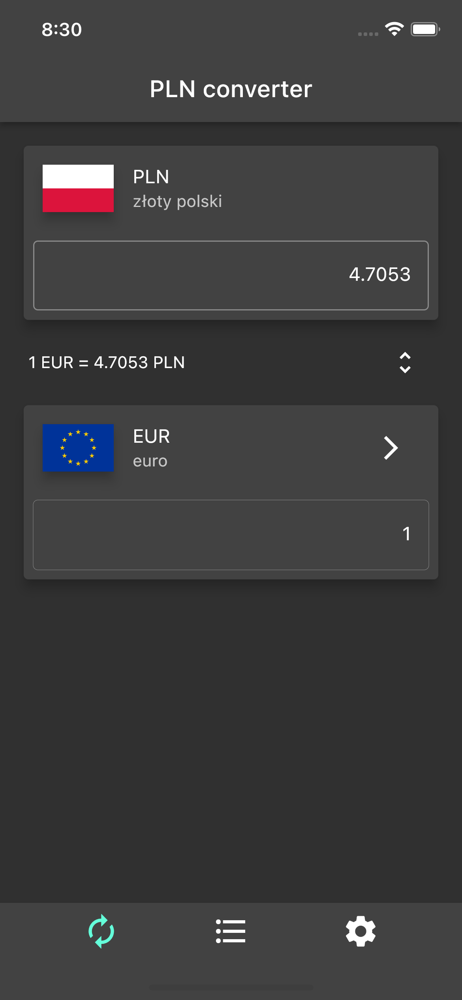
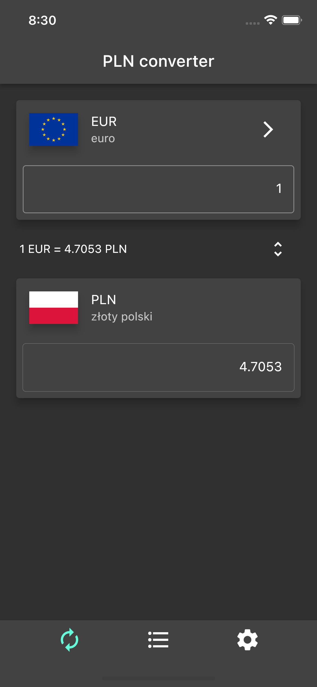
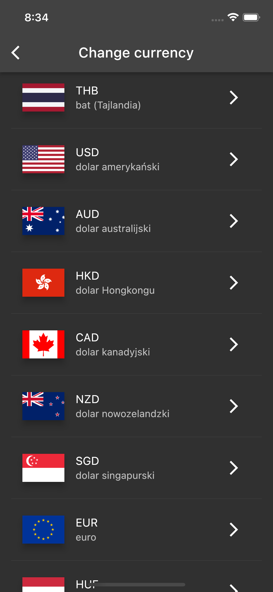
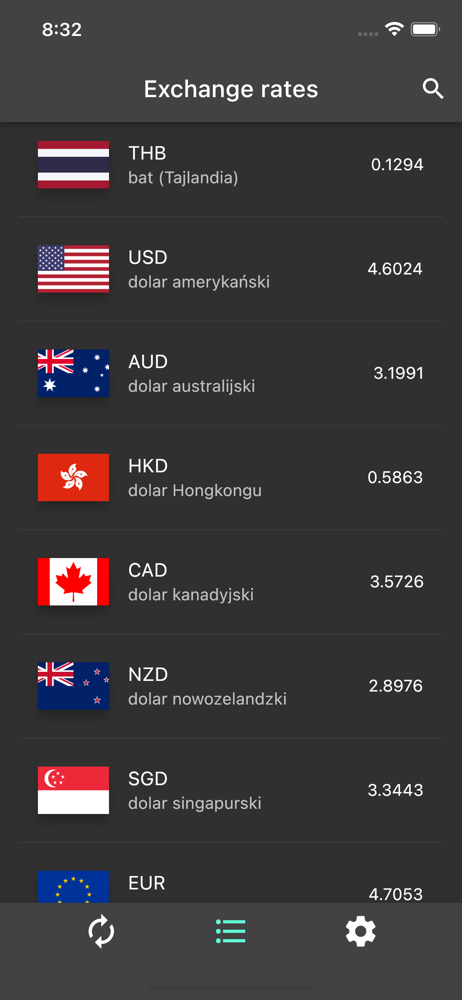
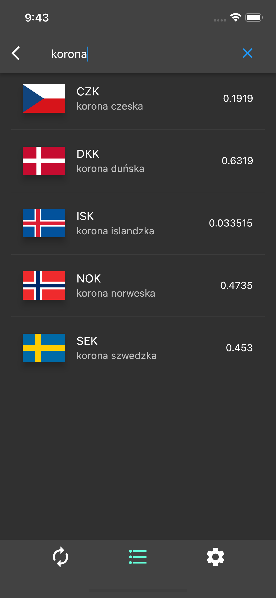
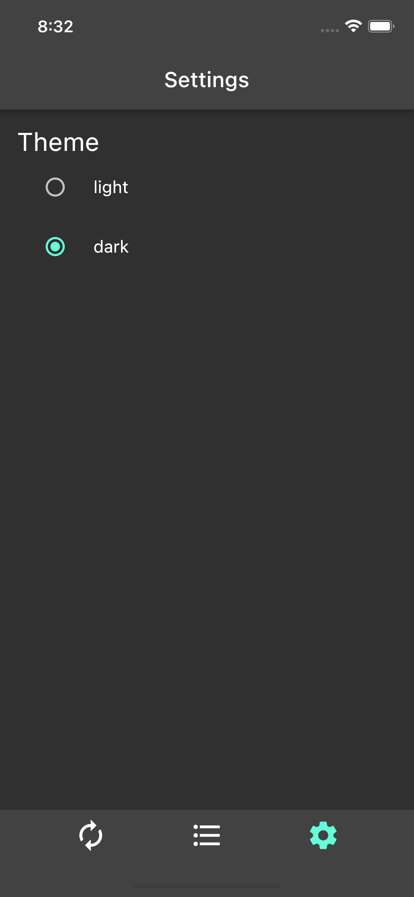
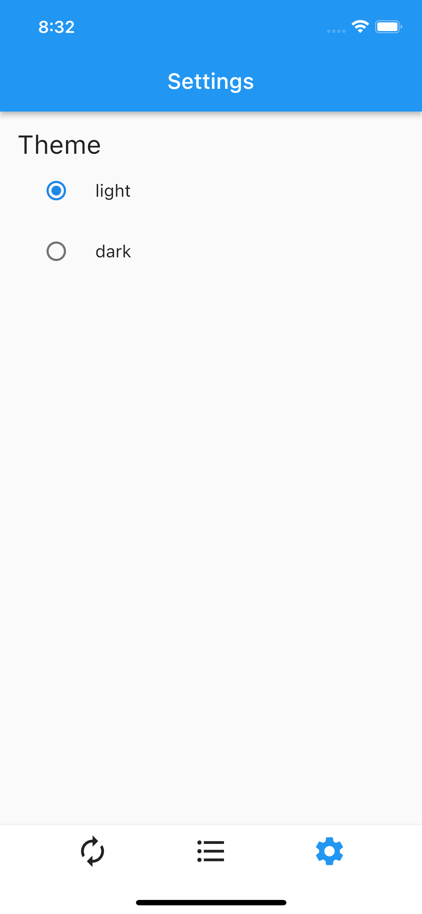

<a href="https://github.com/gzaber/pln_converter/actions"></a>
<a href="https://codecov.io/gh/gzaber/pln_converter"></a>
<a href="https://opensource.org/licenses/MIT"></a>

# pln_converter

Polish zloty (PLN) converter to foreign currencies.  
It uses [NBP Web API](http://api.nbp.pl/en.html) to fetching middle exchange rates of foreign currencies.

## Table of contents

- [Screenshots](#screenshots)
- [Features](#features)
- [Packages used](#packages-used)
- [Setup](#setup)
- [Test](#test)
- [Run](#run)

## Screenshots

[](.screenshots/home_converter_eur_down.png)
[](.screenshots/home_converter_eur_up.png)
[](.screenshots/change_currency.png)
[](.screenshots/home_converter_chf_up.png)

[](.screenshots/home_exchange_rates.png)
[](.screenshots/home_exchange_rates_search.png)
[](.screenshots/home_settings.png)
[](.screenshots/home_settings_light_theme.png)

## Features

- convert PLN to foreign currency and vice versa
- change foreign currency
- list of foreign exchange rates
- light / dark theme
- local storage of foreign currency and type of theme
- supported locales: pl, en

## Packages used

- bloc
- dio
- equatable
- intl
- json_annotation
- shared_preferences

## Setup

Clone or download this repository.  
Use the following command to install all the dependencies:

```
$ flutter pub get
```

## Test

Run the tests using your IDE or using the following command:

```
$ flutter test --coverage
```

For local packages run above command in package root directory.

## Run

Run the application using your IDE or using the following command:

```
$ flutter run
```
