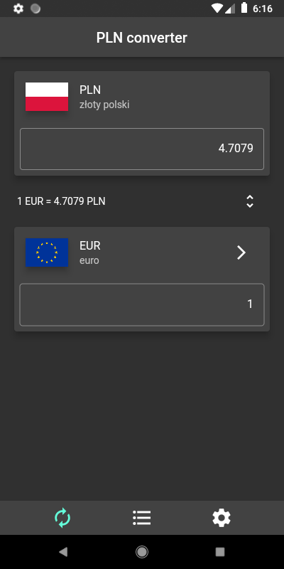
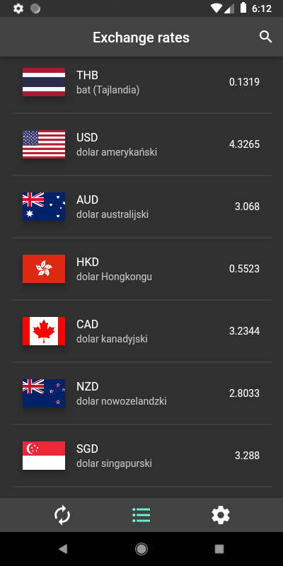
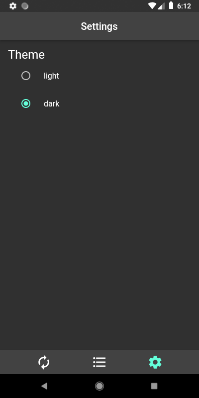
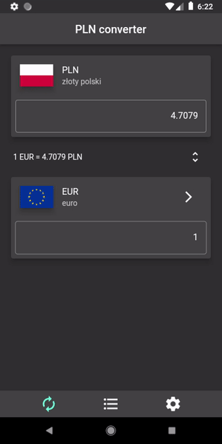
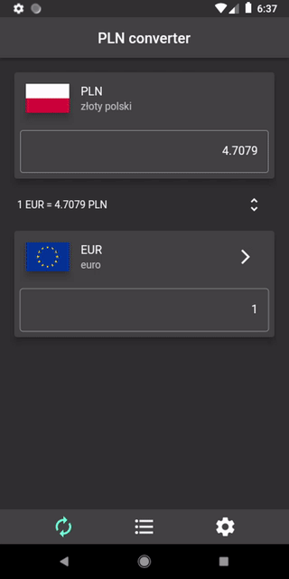
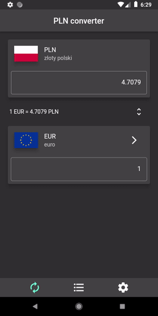

<a href="https://github.com/gzaber/pln_converter/actions"></a>
<a href="https://codecov.io/gh/gzaber/pln_converter"></a>
<a href="https://opensource.org/licenses/MIT"></a>

# pln_converter

Polish zloty (PLN) converter.
It converts polish zloty to foreign currencies and vice versa.  
It uses [NBP Web API](http://api.nbp.pl/en.html) to fetch middle exchange rates of foreign currencies.

## Table of contents

- [Screenshots](#screenshots)
- [Features](#features)
- [Packages used](#packages-used)
- [Setup](#setup)
- [Test](#test)
- [Run](#run)

## Screenshots

[](.screenshots/converter_page.png)
&nbsp;
[](.screenshots/exchange_rates_page.png)
&nbsp;
[](.screenshots/settings_page.png)

[](.screenshots/converter_page_recording.gif)
&nbsp;
[](.screenshots/exchange_rates_page_recording.gif)
&nbsp;
[](.screenshots/settings_page_recording.gif)

## Features

- convert PLN to foreign currency and vice versa
- change foreign currency
- list of foreign exchange rates
- search exchange rates
- light / dark theme
- local storage of foreign currency and type of theme
- supported locales: en, pl

## Packages used

- bloc
- dio
- json_annotation
- shared_preferences

## Setup

Clone or download this repository.  
Use the following command to install all the dependencies:

```
$ flutter pub get
```

## Test

Run the tests using your IDE or using the following command:

```
$ flutter test --coverage
```

For local Flutter packages run the above command in the package root directory.  
For local Dart packages run the following commands in the package root directory:

```
$ dart pub global activate coverage
$ dart pub global run coverage:test_with_coverage
```

## Run

Run the application using your IDE or using the following command:

```
$ flutter run
```
